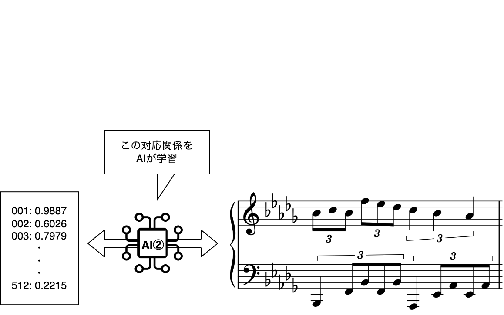
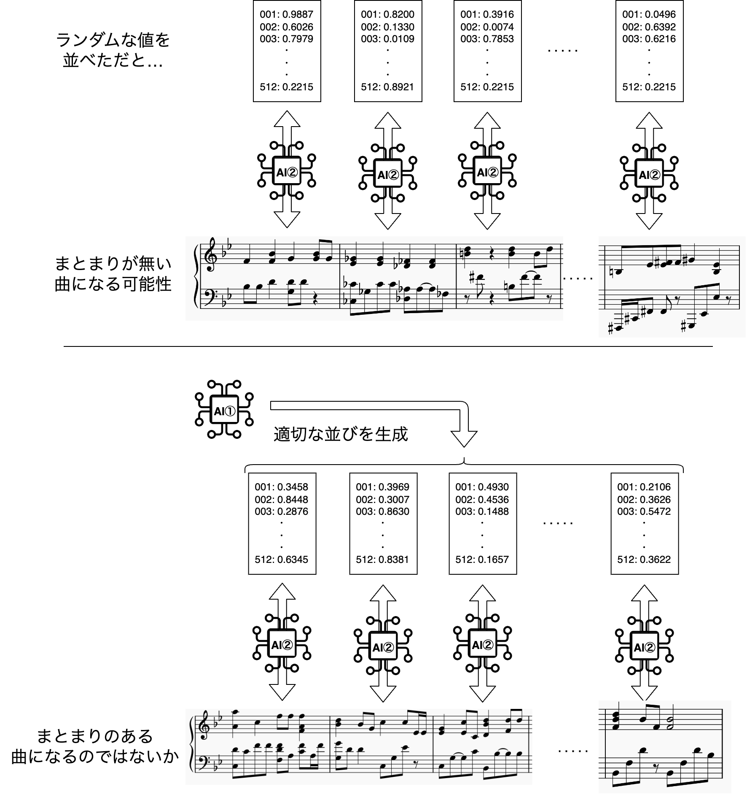

<!-- Google tag (gtag.js) -->

# このページについて

このページを見て頂きありがとうございます! 名古屋大学の澤田桂都です。

2024年度EXPIの演目について、プログラムには書ききれなかった部分をつらつらと書き綴ります。最後まで読んでいただければ幸いです。

プログラムに掲載頂いた情報はこちらです。

> 習作 est_048_0100
(システム名 : 未定, 論文タイトル : "Hierarchical symbolic music composition based on bar-feature sequence modeling for global structure generation")

> コメント：大学院で開発した作曲AIが作った曲です。以前Mulshe（MULti Stage Harmonic Engine）という名前をつけたのですが、最近先生に「提案手法の本質を捉えた名前になっていない」と却下され、それ以名前がまだ決まっていないので論文タイトル（3月?に公開）を作曲者名にしておきました

> 名古屋大学 大学院２年 情報学研究科知能システム学専攻 澤田桂都

同じ演目で2024年度旧帝大コンサートにも出演しましたが、「自作・自演」ならぬ「自作AI作・自演」と言ったところウケが良くてすっかり味をしめてしまったので、今回もこの演目で出演させていただきました。

# 演目概要

パッと見て「なんじょこりゃ」って思った方もいらっしゃるのではないでしょうか。
この演目は、筆者が開発した作曲AIによって生成された楽曲を演奏するものです。
大学院で作曲AIの性能向上の研究に取り組んでおり、現在もこの研究について修論にまとめている最中です（そろそろ締め切りが迫ってきて追い込まれつつあります（泣））。
今回演奏する曲は、8月時点での最新のAIの実験で生成された楽曲で、"est_048_0100"という部分は実験の管理のための番号です。
AIが作った曲を聴く機会もなかなかないのではと思うので、ぜひこの機会にお聴き頂ければ幸いです。

# 衣装について

黒の長袖、紺色のジーンズ、灰色のスニーカー。ここから連想される人物といえば、誰でしょうか?

ご存知の方もいらっしゃるのではないでしょうか。iPhoneやMacなどでおなじみ、Appleの元最高経営責任者、スティーブ・ジョブズ氏は、毎日同じ服を着ることで意思決定の簡略化を図ったと言われています。

    

ITつながりということで、インスパイアとリスペクトを込めて、ジョブズ氏の毎日の服を真似した衣装で演奏します。決してクローゼットからテキトーに引っ張ってきた私服ではありません。

# AIシステムについて（簡単バージョン）

ここでは実際に使った作曲AIについて、情報技術やAI技術に馴染みのない方でもわかるような説明を心がけます。一部簡単な説明に置き換えるために正確さを欠く表現があります。ご了承ください。

以前 "Mulshe" という名前をつけたと述べましたが、「Multi Stage」の名前の通り、一度にポンと楽曲ができるのではなく、**いくつかの段階を経て**作曲をします。今回は、2段階の作曲AIを使いました。

いきなり難しめの話になってしまいますが、既存の研究[1]によって、16分音符から全音符までの長さの音符で作られたポピュラーソングのほとんどの小節は、512個の数値の組み合わせによって意味のある表現ができることが明らかになっています。
ここでの「意味のある表現」とは、似た楽曲が近い値になっていたり、2曲の値の平均を取ると中間のような楽曲になっていることを表します。
更に、この値と楽曲は相互に変換が可能です。
この、「512個の数字の組み合わせ」⇔「1小節分の楽曲」の変換を行うAIを最初に構築します。

    

ここまでで、存在しうる楽曲の小節のほとんどは、512個の数字の組み合わせで表現できることがわかりました。
しかし、ランダムに512個の数字の組み合わせを並べても、自然な楽曲になるとは限りません。
もしかしたら、毎小節転調するなど、前後のつながりが無いものになってしまうかもしれません。
そのため、512個の数字を適切に選んで並べる必要があります。

話題は変わりますが、SiriやAIりんな（LINE bot）、ChatGPTなどの、文章や音声で人と会話できるAI技術をご存知でしょうか。これらのシステムは、単語をうまく並べることで違和感の無い対話を実現している、と言えます。例えば、「今日の東京の天気は?」と聞けば、「"本日" "、" "9月" "8日" "の" "東京" "の" "天気" "は" …」というように、適切に単語を並べて自然な回答してくれることでしょう。
音楽も同じように、小節を適切に並べることで違和感が少ないものとなると予想されます。

    

そこで、**1段階目**の作曲手順として、小節ごとの512個の値の並びを作るAIシステム①が登場します。
このシステムは、コード進行を指定すると、それを参考に（完全に従うわけではありません）512個の値の並びを作ってくれます。
続いて**2段階目**では、①が作った512個の値の並びに従って順番に、小節ごとに作曲を行います。

この内容は現在、国際学会への発表の準備をしています。

# AIシステムについて（詳細バージョン）

こちらでは、情報技術分野に詳しい方も満足できるよう、8月上旬の研究発表会のポスターを掲載します。

    

ご質疑・ご議論等あればぜひ会場でお声がけください（学会発表風口調）。

今回のAIは、このうち "AR w\ conditioning" を70小節に拡張したものを使いました。

# 余談

このwebページは1/11（土）0:50頃に眠い目をこすりながら作成しています。
演奏会開演まで12時間…あくびが止まらないです。
こんなの作ってるならその分練習しろって言われそうです（主に連弾の相方たちから）。

ホントはもっとゆとりを持って書く予定だったんですが、修論と実験に追われて気づいたら演奏会当日…
粗い部分も多いかと思いますが、ご容赦くださいませ。

# 参考
- [1] Ziyu Wang et.al. "Learning interpretable representation for controllable polyphonic music generation", ISMIR 2020
