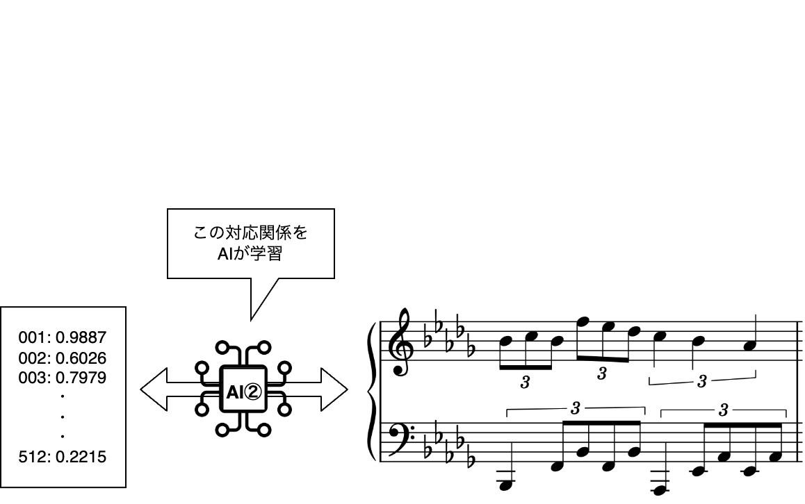
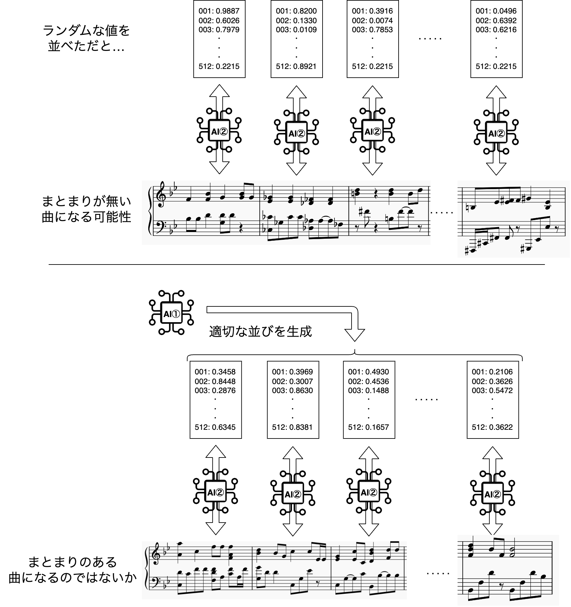
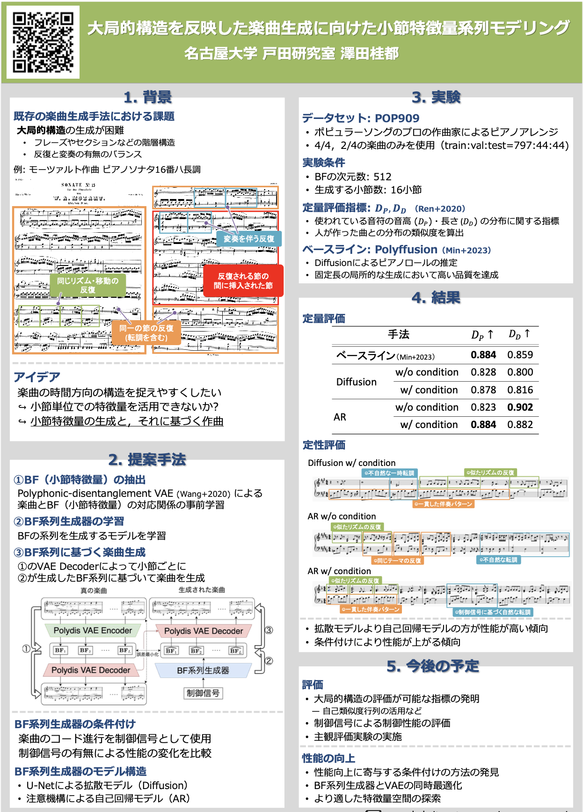

# このページについて

このページを見て頂きありがとうございます! 名古屋大学の澤田桂都です。

2024年度旧帝大コンサートの演目について、文字数の制限でプログラムには書ききれなかった部分をつらつらと書き綴ります。最後まで読んでいただければ幸いです。

プログラムに掲載頂いた情報はこちらです。

> 習作 est_latent_051_flatten_0030
(Diff_UNet_PdVAE)

> 大学院で研究中の、自作の作曲AIが作った曲を演奏します。
詳細はこちら [https://katesawada.github.io/24ktc](https://katesawada.github.io/24ktc)

>情報学研究科修士2年 澤田桂都

# お詫びと訂正

プログラム提出時点では、「Diff_UNet_PdVAE」という名前のシステムを研究していたのですが、その後試した手法で大きく性能が改善したため、作曲者（作曲システム）が変更されました。

正しくは、「**Mulshe** (**Mul**ti-**S**tage **H**ermonic **E**ngine)」になります。どうぞお見知りおきください。ちなみに、この読み方がまだ定まっていません。フランス語っぽい語感かなあと思っていますが、もしいいアイデアをお持ちの方は教えていただければ幸いです。

また、作曲AIの更新に伴って演奏する楽曲も変更になりました。当初は実験の番号を曲名にしていたのですが、新しいシステムでの実験結果に変更となったため、正しくは「習作 est_048_0100」になります。

プログラムの印刷に間に合えばよかったのですが、訂正がギリギリになってしまい難しいとのことだったため、こちらでの訂正とさせて頂きます。

# 衣装について

黒の長袖、紺色のジーンズ、灰色のスニーカー。ここから連想される人物といえば、誰でしょうか?

ご存知の方もいらっしゃるのではないでしょうか。iPhoneやMacなどでおなじみ、Appleの元最高経営責任者、スティーブ・ジョブズ氏は、毎日同じ服を着ることで意思決定の簡略化を図ったと言われています。

    

ITつながりということで、インスパイアとリスペクトを込めて、ジョブズ氏の毎日の服を真似した衣装で演奏します。決してクローゼットからテキトーに引っ張ってきた私服ではありません。

# AIシステムについて（簡単バージョン）

ここでは実際に使った作曲AI・Mulsheについて、情報技術やAI技術に馴染みのない方でもわかるような説明を心がけます。一部簡単な説明に置き換えるために正確さを欠く表現があります。ご了承ください。

Mulsheは「Multi Stage」の名前の通り、一度にポンと楽曲ができるのではなく、**いくつかの段階を経て**作曲をします。今回は、2段階の作曲AIを使いました。

いきなり難しめの話になってしまいますが、既存の研究[1]によって、16分音符から全音符までの長さの音符で作られたポピュラーソングのほとんどの小節は、512個の数値の組み合わせによって意味のある表現ができることが明らかになっています。
ここでの「意味のある表現」とは、似た楽曲が近い値になっていたり、2曲の値の平均を取ると中間のような楽曲になっていることを表します。
更に、この値と楽曲は相互に変換が可能です。
この、「512個の数字の組み合わせ」⇔「1小節分の楽曲」の変換を行うAIを最初に構築します。

    

ここまでで、存在しうる楽曲の小節のほとんどは、512個の数字の組み合わせで表現できることがわかりました。
しかし、ランダムに512個の数字の組み合わせを並べても、自然な楽曲になるとは限りません。
もしかしたら、毎小節転調するなど、前後のつながりが無いものになってしまうかもしれません。
そのため、512個の数字を適切に選んで並べる必要があります。

話題は変わりますが、SiriやAIりんな（LINE bot）、ChatGPTなどの、文章や音声で人と会話できるAI技術をご存知でしょうか。これらのシステムは、単語をうまく並べることで違和感の無い対話を実現している、と言えます。例えば、「今日の東京の天気は?」と聞けば、「"本日" "、" "9月" "8日" "の" "東京" "の" "天気" "は" …」というように、適切に単語を並べて自然な回答してくれることでしょう。
音楽も同じように、小節を適切に並べることで違和感が少ないものとなると予想されます。

    

そこで、**1段階目**の作曲手順として、小節ごとの512個の値の並びを作るAIシステム①が登場します。
このシステムは、コード進行を指定すると、それを参考に（完全に従うわけではありません）512個の値の並びを作ってくれます。
続いて**2段階目**では、①が作った512個の値の並びに従って順番に、小節ごとに作曲を行います。

この内容は現在、国際学会への発表の準備をしています。

# AIシステムについて（詳細バージョン）

こちらでは、情報技術分野に詳しい方も満足できるよう、8月上旬の研究発表会のポスターを掲載します。

    

ご質疑・ご議論等あればぜひ会場や交流会などでお声がけください。

今回のMulsheは、このうち "AR w\ conditioning" を70小節に拡張したものを使いました。

# 裏話: 旧帝コン当日に至るスケジュール

実は、今回のコンサートに向けたスケジュールがかなりカツカツでした（ご迷惑をおかけした皆様、すいませんでした…）。

### 6月・エントリー
実はエントリー〆切時点（名大のサークル内〆切は6/18でした）では演奏する曲はおろか、AIシステムが未完成という状態での見切り発車で応募をしていました。
なので、その時に作っていたシステムと実験番号で「これで完成するだろう」と見込んでエントリーをしました。

しかし、あんなことになろうとは思ってもいませんでした…

### 7月・AIシステム・完成…?
エントリー時点で研究していたシステム・Diff_UNet_PdVAEが一通り完成した…と思いましたが、イマイチ性能が出ず、不自然な楽曲しか作ることができませんでした。
また、8月上旬に研究発表を控えており、そこまでにどうにか性能を改善したいという研究の都合もあり、大幅に手法を見直すことになりました。
7月は結構夜遅くまで研究室にこもって研究していたような気がします。

### 8月・今度こそ…!
奮闘の甲斐あり、また、研究室メンバーや先生方の助言のお陰で、既存作曲AIの手法に劣らない性能のシステムを作ることができました。Mulsheの誕生です。

前述の8月上旬の研究発表会（東海地区音声関連研究室 修論中間発表会）では、見事総合3位を受賞することができました。
また、追加の実験をして国際会議への投稿を行うことになり、またも研究室にこもって実験する日々が続きました。

### 9月・猛特訓
やっと一段落した…と思ったら、もう9月。
急いで演奏会に向けて楽曲の生成をしました。

しかし、今のシステムはMIDIと呼ばれる形式での生成をするため、そのままでは演奏ができず、楽譜を書き起こす必要がありました。
楽譜の書き起こしが終わったのは、驚愕の演奏会4日前。
そこからピアノ以外のすべてを投げ捨てて猛特訓をして、どうにか人前で演奏できる程度には仕上げることができたかと思います。
ゆる〜くご期待ください。

ちなみに、このWebサイトは演奏会前日の夜に必死に作っています（現在9/6 23:25）。
ついでに、衣装は演奏会の前々日に買い揃えました。
来年度以降はもっとゆとりを持ったスケジュールで臨みます…

# 参考
- [1] Ziyu Wang et.al. "Learning interpretable representation for controllable polyphonic music generation", ISMIR 2020
